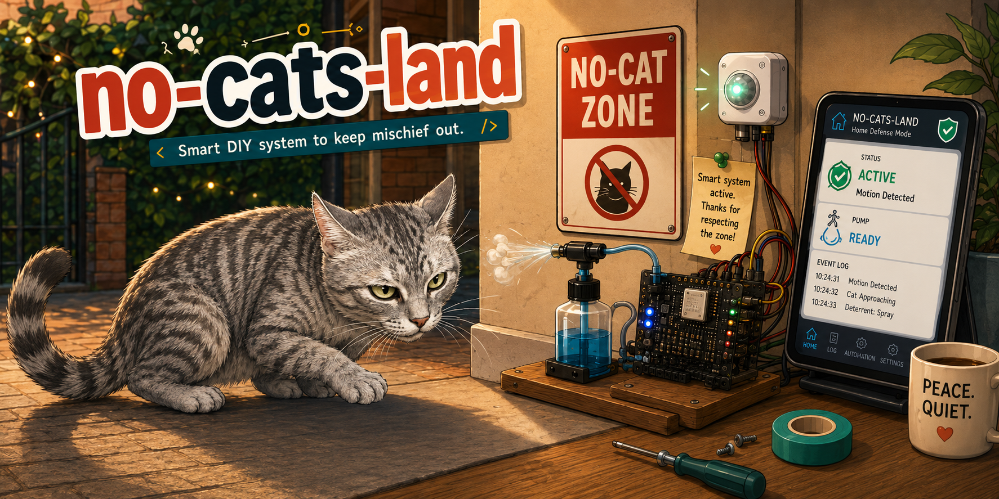

# no-cats-land 🐱🚱



> *"The best-fortified line of defense is useless if the enemy simply walks around it."*
> — the spirit of the Maginot Line, patron of this project

A water- (and otherwise-) based, motion-triggered cat deterrent driven by an
**Arduino Nano 33 IoT**. A PIR sensor detects the cat entering an alcove → the
microcontroller fires a short, harmless burst from a 12V diaphragm pump.

The name plays on *no man's land* — and like the Maginot Line, it's a defense you can
simply walk around.

## Hardware (summary — full BOM in `CLAUDE.md`)

- Arduino Nano 33 IoT (SAMD21 + WiFi NINA, **3.3V logic**)
- PIR HC-SR501 — `OUT → D2`
- (to buy) 12V diaphragm pump + **D4184** MOSFET module (opto-isolated, works from 3.3V)
  + flyback diode 1N5819 + 12V PSU. Everything on a **single 12V rail, common ground**.

## Layout

| Folder | What |
|---|---|
| `no_cats_land/` | 🎯 main firmware — local detection + pump pulse, armable from Home Assistant over WiFi (REST) |
| `test_pir/` | 🔬 motion-sensor test & diagnostics |
| `test_wifi/` | 📶 WiFi test — serves the sensor state at `http://<board-ip>/` |
| `blink/` | 💡 first LED blink smoke-test |

> Each sketch (`.ino`) lives in its own same-named folder — an Arduino requirement.

## Build & upload

```bash
# compile (find the port with: arduino-cli board list)
arduino-cli compile --fqbn arduino:samd:nano_33_iot ./no_cats_land
arduino-cli upload -p /dev/cu.usbmodem1201 --fqbn arduino:samd:nano_33_iot ./no_cats_land
```

## WiFi credentials

`arduino_secrets.h` is **not in the repo** (it holds the password). Both WiFi sketches need
their own copy:

```bash
cp no_cats_land/arduino_secrets.example.h no_cats_land/arduino_secrets.h
cp test_wifi/arduino_secrets.example.h    test_wifi/arduino_secrets.h
# then fill in your SSID + password in each
```

## Home Assistant control (REST)

The main firmware runs detection and the pump **locally** (works even if WiFi/HA is down).
Home Assistant only arms/disarms and monitors, via HTTP:

| Endpoint | Action |
|---|---|
| `GET /status` | telemetry JSON (armed, state, motion, shots, events, last_motion_s, cooldown_left_s, uptime_s, rssi, and the live timings) |
| `GET /arm` / `/disarm` | arm / disarm |
| `GET /test` | fire one manual test pulse (works even when disarmed) |
| `GET /reset` | reset the telemetry counters |
| `GET /set?pulse=&cooldown=&hold=&warmup=&maxshots=` | live-tune settings (no reflash) |

Full HTTP API reference (params, status fields, examples): [`docs/api.md`](docs/api.md).

The board starts disarmed on first flash, then **remembers its armed state and shot count
across reboots** (flash). Motion sensing + telemetry run even while disarmed (so you can
calibrate from HA); the pump only fires when armed. A safety cap auto-disarms after
`max_shots` shots (tunable, `0` = off) and HA pops a notification when that happens — and on
every shot.

Give the board a fixed address (DHCP reservation on the router), then paste
[`docs/home-assistant.yaml`](docs/home-assistant.yaml) — it provides an arm **switch**,
**motion** binary_sensor, telemetry **sensors**, **test fire / reset** buttons, live-tuning
**sliders** (pulse/cooldown/hold/max-shots) and **shot + auto-disarm notifications**. A ready
Mushroom dashboard is in [`docs/dashboard-no-cats-land.yaml`](docs/dashboard-no-cats-land.yaml).

## PIR calibration

- **Left pot = sensitivity/range**, **right pot = hold time**.
- Both fully left = minimum. Sensitivity ~1/4 right catches motion at 1–2 m.
- Live sensor state: `curl http://<board-ip>/` (returns `MOTION` / `idle`).

## Status

- ✅ sensor wired, verified, roughly calibrated; reports over WiFi
- ✅ firmware: local state machine (warm-up → idle → pulse → cooldown) + REST arm/disarm/status
- ⏳ buy pump/MOSFET/diode/PSU; wire the pump; add to Home Assistant; final mounting
